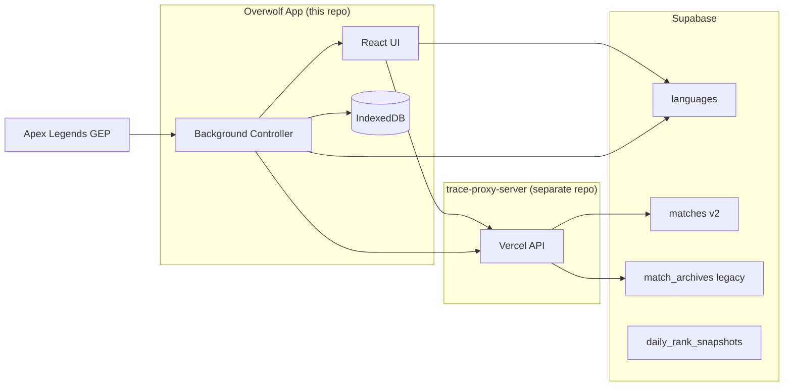

# ApexTrace

**Repository:** https://github.com/sjbong0904/ApexTrace-app  
**Current version:** `0.0.5` — see [docs/RELEASE_NOTES.md](docs/RELEASE_NOTES.md)

Apex Legends match tracking, movement path visualization, and stats overlay built as an [Overwolf](https://www.overwolf.com/) desktop app. ApexTrace listens to in-game events (GEP), records match data locally, syncs history to the cloud, and presents analytics across a second-screen desktop window and an in-game overlay.

---

## Architecture overview

ApexTrace is split across three layers. This repo contains the **Overwolf client app** and **Supabase schema migrations**. The **Vercel API proxy** lives in a separate repository.



| Layer | Role |
|-------|------|
| **Overwolf app** | GEP event capture, match session state, local cache, UI |
| **Vercel proxy** | Mozambique API proxy, player search, match upload/download, CORS-safe backend |
| **Supabase** | i18n strings, normalized match storage (v2), rank snapshots |

Default proxy URL: `https://trace-proxy-server.vercel.app/api` (configured in `public/background/config.js`).

---

## Overwolf windows

Defined in [`manifest.json`](manifest.json):

| Window | File | Purpose |
|--------|------|---------|
| `background` | `background.html` | Hidden controller — GEP, hotkeys, match lifecycle, cloud sync |
| `desktop` | `index.html` | Second-screen window (native OS window, `desktop_only`) |
| `in_game` | `index.html` | Transparent in-game overlay (`in_game_only`) |
| `worker` | `worker.html` | Small helper window for monitor / display detection |

**Hotkeys** (configurable in Settings):

| Hotkey | Default | Action |
|--------|---------|--------|
| `toggle_desktop_window` | `Ctrl+Shift+=` | Show/hide second-screen window |
| `toggle_in_game_window` | `Ctrl+Shift+-` | Show/hide in-game overlay |

Target game: Apex Legends (`game_id: 21566`).

---

## Data flow

### During a match

1. **Background** subscribes to Overwolf GEP events via [`public/background/events.js`](public/background/events.js).
2. Match state is held in `window.Store` ([`public/background/main.js`](public/background/main.js)): map, mode, legend, combat log, movement path, loadout changes, etc.
3. On match end, [`public/background/services/matchService.js`](public/background/services/matchService.js) finalizes the session and [`public/background/repository.js`](public/background/repository.js) POSTs to the proxy (`/history`).

### History & stats

1. React UI ([`src/App.tsx`](src/App.tsx)) loads player stats and match history through the proxy (`/apex-stats`, `/history`, `/search-candidates`).
2. Responses are normalized by [`src/utils/matchNormalizer.ts`](src/utils/matchNormalizer.ts) so the frontend keeps a stable shape across legacy archives and v2 rows.
3. Recent matches are cached in **IndexedDB** via [`src/utils/LocalDB.ts`](src/utils/LocalDB.ts).

### Match Storage V2

New matches are stored as one row per match in `public.matches`. Legacy bulk archives remain in `public.match_archives`. Full schema and rollout notes: [docs/match-storage-v2.md](docs/match-storage-v2.md).

---

## Tech stack

| Area | Stack |
|------|-------|
| UI | React 19, TypeScript, Vite 7 |
| Charts | Recharts |
| i18n | i18next + Supabase `languages` table |
| Theming | CSS variables via [`src/theme/`](src/theme/) (dark / light) |
| Background | Vanilla JS modules on `window` (Overwolf background page) |
| Local storage | IndexedDB |
| Cloud DB | Supabase (Postgres) |
| Backend API | Vercel serverless (separate `trace-proxy-server` repo) |

---

## Project structure

```
apex-trace/
├── manifest.json              # Overwolf app manifest (version, windows, hotkeys, permissions)
├── index.html                 # Desktop + in-game UI entry
├── background.html            # Background controller entry
├── worker.html                # Display helper entry
├── uninstall.html / .js       # Uninstall survey window
├── game_constants.json        # Static game reference data
│
├── src/                       # React frontend (TypeScript)
│   ├── App.tsx                # Main shell: sidebar, map, tabs, match list
│   ├── main.tsx               # Entry — Overwolf → App, browser → SimpleWebApp
│   ├── components/            # UI components (MapVisualizer, MatchStats, SettingsTab, …)
│   ├── theme/                 # ThemeProvider, dark/light token sets
│   ├── hooks/                 # useWindowAutoResize, …
│   ├── utils/                 # helpers, LocalDB, matchNormalizer, WeaponsData, tutorial
│   ├── lib/                   # supabase client, loadLanguages
│   ├── constants/             # APP_LANGUAGES (BCP 47 codes)
│   ├── web/                   # Browser-only preview (SimpleWebApp + api.ts)
│   └── types.ts               # Shared TypeScript types
│
├── public/background/         # Overwolf background controller (JavaScript)
│   ├── main.js                # Window control, Store, game lifecycle, hotkeys
│   ├── events.js              # GEP event router (combat, match_info, revive, …)
│   ├── repository.js          # Proxy client (search, history save/fetch, address book)
│   ├── config.js              # PROXY_BASE_URL
│   ├── utils.js               # Name/mode normalization, helpers
│   └── services/
│       ├── apiService.js      # Stats & history fetch
│       ├── matchService.js    # Match finalization & upload
│       └── mapService.js      # Map metadata
│
├── scripts/
│   ├── locale-seeds/          # Translation source JSON (10 languages, BCP 47)
│   ├── seed-languages.ts      # Push locale seeds → Supabase
│   ├── generate-zh-tw.mjs     # Regenerate zh-TW from zh-CN
│   └── generate-locale-migration.mjs
│
├── supabase/migrations/       # Postgres schema (languages, matches v2, rank snapshots)
├── docs/
│   ├── RELEASE_NOTES.md       # Version changelog
│   └── match-storage-v2.md    # Match v2 storage design
│
└── dist/                      # Production build output (gitignored) — load as unpacked extension
```

---

## Requirements

- **Node.js 20+**
- **Overwolf client** — for running the unpacked extension
- **Supabase project** — apply migrations in `supabase/migrations/`
- **Vercel proxy** — deployed separately (`trace-proxy-server`); not included in this repo

---

## Setup

```bash
npm install
cp .env.example .env          # optional; needed for seed:languages only
npm run dev                   # Vite dev server (browser preview via SimpleWebApp)
npm run build                 # Output to dist/
```

### Load in Overwolf (unpacked)

1. Run `npm run build`.
2. In Overwolf → Settings → Support → Development options → Load unpacked extension.
3. Select the `dist/` folder.

For local proxy development, set `window.PROXY_BASE_URL` or edit [`public/background/config.js`](public/background/config.js) before building.

---

## Scripts

| Command | Description |
|---------|-------------|
| `npm run dev` | Vite dev server |
| `npm run build` | TypeScript check + production build → `dist/` |
| `npm run preview` | Preview production build |
| `npm run lint` | ESLint |
| `npm run seed:languages` | Push `scripts/locale-seeds/*.json` to Supabase |

---

## Internationalization

- **Runtime:** translations loaded from Supabase `public.languages` ([`src/lib/loadLanguages.ts`](src/lib/loadLanguages.ts))
- **Source of truth in Git:** [`scripts/locale-seeds/*.json`](scripts/locale-seeds/)
- **Push to Supabase:** `npm run seed:languages` (requires `SUPABASE_SERVICE_ROLE_KEY` in `.env`)
- **Language codes:** BCP 47 (`en`, `ko`, `zh-CN`, `zh-TW`, `es-ES`, `es-MX`, `pt-BR`, `pt-PT`, `fr`, `ja`)
- **Regenerate zh-TW:** `node scripts/generate-zh-tw.mjs`

---

## Database (Supabase)

Apply migrations in chronological order:

| Migration | Purpose |
|-----------|---------|
| `20260522100000_create_languages.sql` | `languages` table for i18n |
| `20260522110000_add_es_mx_pt_pt_languages.sql` | Additional locale rows |
| `20260522120000_add_zh_tw_language.sql` | zh-TW locale |
| `20260522130000_language_bcp47_codes.sql` | BCP 47 lang code migration |
| `20260624054500_create_daily_rank_snapshots.sql` | Daily rank snapshot table |
| `20260624055100_create_matches.sql` | Normalized `matches` table (v2) |
| `20260624055600_add_match_v2_optional_stats.sql` | Optional stat columns |
| `20260624060600_add_match_v2_timeline_fields.sql` | Timeline fields (weapon_timeline, ring_rounds, …) |
| `20260624062600_matches_uid_match_id_primary_key.sql` | Composite PK `(uid, match_id)` |

Legacy table `match_archives` is managed by the proxy repo and is not recreated here.

---

## UI features (high level)

- **Match list & map** — movement path overlay per match, ring rounds (when GEP provides data)
- **Match detail tabs** — Stats + Loadout Timeline (weapon change history)
- **Statistics** — aggregated performance, trends, combat log
- **Weapons tab** — weapon / hop-up reference
- **Settings** — theme (dark/light), in-app hotkey rebinding, tutorial, log folder
- **Player search** — autocomplete via proxy, multi-profile local history

---

## Related repositories

| Repo | Purpose |
|------|---------|
| **ApexTrace-app** (this repo) | Overwolf client, UI, background controller, Supabase migrations |
| **trace-proxy-server** | Vercel-hosted API — Mozambique proxy, match CRUD, player search |

Do not commit `trace-proxy-server/` into this repo (see [`.gitignore`](.gitignore)).

---

## Documentation

- [Release notes](docs/RELEASE_NOTES.md)
- [Match Storage V2 design](docs/match-storage-v2.md)

---

## License

All rights reserved © 2026 ApexTrace.
