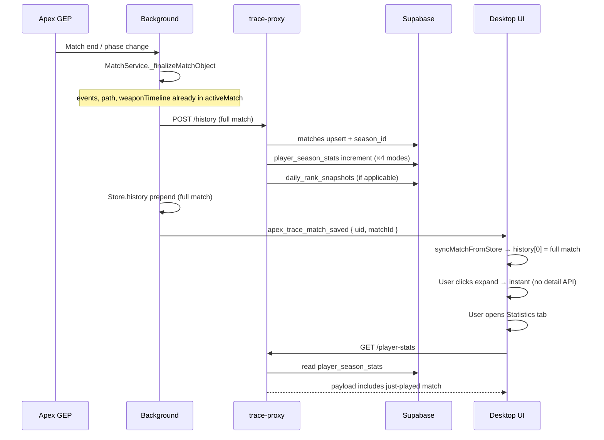
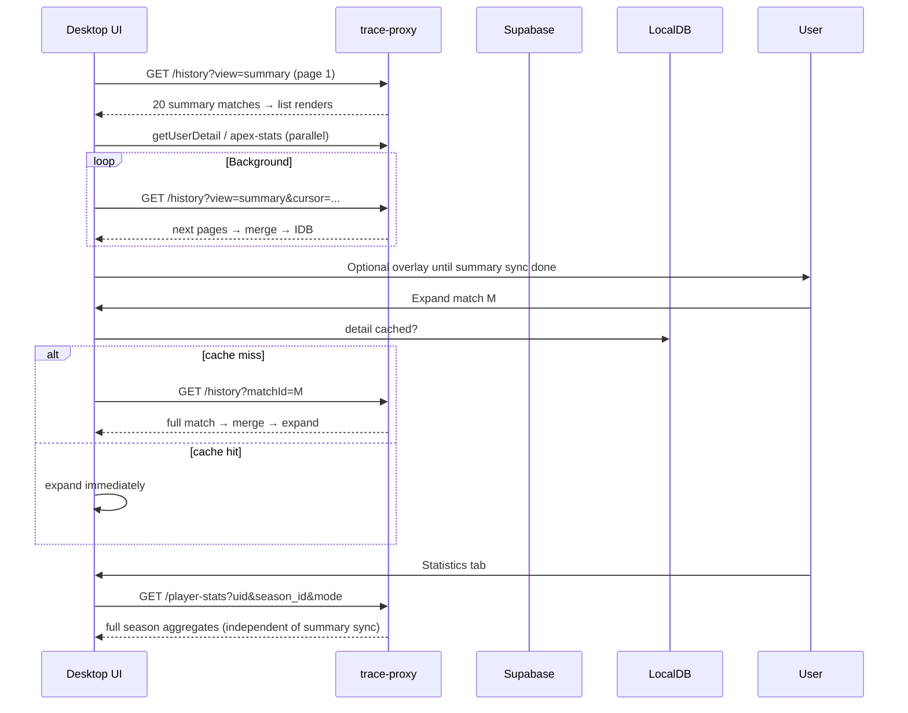

# Match Data Architecture V3

ApexTrace match data, statistics, and client loading strategy.

**Status:** Shipped. Supabase migrations applied; production proxy deployed at `trace-proxy-server.vercel.app`.  
**Supersedes (partially):** [match-storage-v2.md](./match-storage-v2.md) read path and client-side statistics aggregation  
**Related:** `trace-proxy-server/api/history.js`, `src/App.tsx`, `src/components/StatisticsTab.tsx`, `public/background/services/matchService.js`

---

## 1. Goals

| Goal | Description |
| --- | --- |
| Fast first paint | Another user's profile shows match list quickly, even with thousands of stored matches |
| Complete statistics | Statistics tab shows **full season** aggregates without waiting for client-side history sync |
| Complete match detail | Combat Log, map path, loadout timeline are available when a match is expanded |
| Server as source of truth | Supabase holds seasons, matches, and precomputed stats; the app is primarily a display and live-capture shell |
| v2 `matches` only | `public.match_archives` (v1) is no longer read or written |

---

## 2. Design principles

### 2.1 Client role (“shell”)

The Overwolf extension still owns:

- Live match capture from GEP (events, path, weapons during play)
- Background finalize and upload queue
- `Store.history` for the active local session
- LocalDB (IndexedDB) cache for offline / repeat visits
- UI rendering and navigation

The client **does not** recompute full season statistics from raw match rows in the target design.

### 2.2 Server role (source of truth)

The proxy + Supabase own:

- Season definitions (single source of truth)
- Normalized match rows (`public.matches`)
- Precomputed season statistics (`public.player_season_stats`)
- Daily rank snapshots (existing, for RP charts)

### 2.3 Three data tiers

```
┌─────────────────────────────────────────────────────────────────┐
│ Tier 1 — Summary     List cards, sidebar tags, stats inputs     │
│                      (no events, path, legacy_match blob)       │
├─────────────────────────────────────────────────────────────────┤
│ Tier 2 — Detail      events, path, weapon_timeline, ring_rounds │
│                      Loaded per match on expand (or prefetch)   │
├─────────────────────────────────────────────────────────────────┤
│ Tier 3 — Season stats  Aggregated JSONB per uid/season/mode     │
│                        Statistics tab reads this directly       │
└─────────────────────────────────────────────────────────────────┘
```

---

## 3. Supabase schema

### 3.1 `public.seasons` (SSOT)

Season boundaries must be defined **only** in Supabase. The app reads them via existing config sync (`ConfigController` → `window.SEASONS`). Local `FALLBACK_SEASONS` in `App.tsx` is for bootstrap / offline only.

| Column | Type | Notes |
| --- | --- | --- |
| `id` | `integer` PK | Monotonic season id used in UI (`selectedSeasonId`) |
| `name` | `text` | Display name, e.g. `Season 28 : Split 2` |
| `start_time` | `bigint` | Epoch ms, inclusive |
| `end_time` | `bigint` nullable | Epoch ms, exclusive; `null` = open-ended current split |
| `is_active` | `boolean` | Optional flag for default season in UI |
| `version` | `integer` | Increment when boundaries change; triggers client cache invalidation |

**Assignment rule:** For a match with `start_time` (or `end_time` fallback), find the season where `start_time >= seasons.start_time` and (`end_time` is null or `start_time < seasons.end_time`).

Store resolved `season_id` on the match row at write time (see §3.2).

### 3.2 `public.matches` (v2, extended)

Existing v2 columns remain. Add:

| Column | Type | Notes |
| --- | --- | --- |
| `season_id` | `integer` nullable | Set on INSERT/UPDATE from `public.seasons` |
| `detail_schema_version` | `integer` | Optional; tracks shape of heavy columns |

**Heavy columns** (Tier 2 — excluded from summary API):

- `events`
- `path`
- `weapon_timeline`
- `ring_rounds`
- `legacy_match` (deprecated for reads; do not return in summary)

**Summary columns** (Tier 1 — included in list/sync API):

- All scalar stats, `rank`, `loadout`, `team_stats`, `teammate_kills`, timestamps, mode, map, legend, etc.

Primary key remains `(uid, match_id)`.

Linked accounts: use `resolveRelatedUids()` so reads/writes use `mainUid` consistently (same as today).

### 3.3 `public.player_season_stats` (new)

Precomputed statistics for the Statistics tab.

| Column | Type | Notes |
| --- | --- | --- |
| `uid` | `text` | Player uid (main uid after link resolution) |
| `season_id` | `integer` | FK to `public.seasons.id` |
| `mode` | `text` | `ALL` \| `RANKED` \| `TRIO` \| `DUO` |
| `match_count` | `integer` | Number of matches in this bucket |
| `payload` | `jsonb` | Aggregates (see §3.4) |
| `schema_version` | `integer` | Payload shape version |
| `updated_at` | `timestamptz` | Last increment or recompute |

**Primary key:** `(uid, season_id, mode)`

One new match increments **up to four rows**: `ALL` plus the specific queue bucket (`RANKED`, `TRIO`, or `DUO`).

### 3.4 Statistics `payload` shape (v1)

The payload must satisfy `StatisticsTab` without scanning raw `history`. Exact fields should mirror current client aggregations during migration.

```json
{
  "overview": {
    "wins": 0,
    "avg_placement": "0.0",
    "avg_kills": "0.0",
    "avg_assists": "0.0",
    "avg_damage": "0",
    "total_games": 0
  },
  "legends": [],
  "weapons": [],
  "maps": [],
  "teammates": [],
  "performance_series": [
    {
      "matchId": "1781987842965",
      "startTime": 1781987842965,
      "kills": 3,
      "damage": 1200,
      "placement": 5,
      "legend": "wraith"
    }
  ]
}
```

- **`performance_series`:** Per-match points for Overview line/bar charts (replaces client-side iteration over full `history`).
- **Cap:** Optionally keep last N entries (e.g. 500) per season/mode to bound JSON size.

Rank progress charts continue to use **`daily_rank_snapshots`** (unchanged).

### 3.5 Mode semantics

Statistics tab filters use four modes. These must match `matchesStatisticsMode()` in `src/utils/matchMode.ts`.

| `mode` key | Meaning |
| --- | --- |
| `ALL` | All supported BR-family queues: Ranked + Trio + Duo + unknown mode fallback (`BR`) |
| `RANKED` | Mode string contains `ranked` |
| `TRIO` | Trio, not ranked |
| `DUO` | Duo, not ranked |

`ALL` is **not** the same as the dashboard history tab `BR` filter. Dashboard `BR` uses `matchesHistoryTab()` which groups differently.

---

## 4. API design

Base: `trace-proxy-server` (Vercel). All responses use the legacy camelCase match shape at the HTTP boundary unless noted.

### 4.1 `GET /history`

| Query | Purpose |
| --- | --- |
| `uid` | Required |
| `view=summary` | Default. Returns Tier 1 only (no events/path/legacy_match) |
| `view=detail` | Internal alias; use `matchId` instead for single match |
| `matchId` | If set, return **one** full match (Tier 1 + Tier 2) |
| `matchIds` | Optional batch detail (comma-separated, max ~5) |
| `cursor` | Pagination: `start_time` of oldest item from previous page |
| `startDate` / `endDate` | Range filter (epoch ms); uses `ROWS_PER_FETCH` (200) limit |

**Summary list defaults:**

- Page size: **20**
- Sort: `start_time DESC`
- Source: `public.matches` only

**Response:**

```json
{ "history": [ /* legacy-shaped summary matches */ ] }
```

### 4.2 `POST /history`

Unchanged entry point from the extension. Body:

```json
{ "uid": "...", "match": { /* full legacy match from finalize */ } }
```

**Server actions (in order):**

1. Resolve `mainUid` via `resolveRelatedUids`
2. Resolve `season_id` from `public.seasons` and `match.startTime`
3. Upsert full row into `public.matches`
4. Increment `public.player_season_stats` for `(mainUid, season_id, ALL|RANKED|TRIO|DUO)`
5. Upsert `daily_rank_snapshots` if applicable (existing path)

Do **not** write to `match_archives`.

### 4.3 `GET /player-stats`

| Query | Purpose |
| --- | --- |
| `uid` | Required |
| `season_id` | Required (integer) |
| `mode` | `ALL` \| `RANKED` \| `TRIO` \| `DUO`; default `ALL` |

**Response:**

```json
{
  "uid": "...",
  "season_id": 3,
  "mode": "ALL",
  "match_count": 847,
  "schema_version": 1,
  "updated_at": "2026-06-28T12:00:00Z",
  "payload": { /* see §3.4 */ }
}
```

If no row exists, return empty payload with `match_count: 0` (not 404).

### 4.4 `GET /seasons`

Returns active season list from `public.seasons` (same shape the app already expects for config sync). Eventually replaces hardcoded / config-json seasons.

---

## 5. Client loading strategy

### 5.1 Profile load (any player)

```
1. fetchUserHistory(uid)           → summary page 1 (20 rows) — show list ASAP
2. getUserDetail(uid)              → profile + reuse history promise (no double fetch)
3. Background: summary pagination  → until empty; overlay until “list complete” (product choice)
4. LocalDB: persist summary rows
5. Optional: prefetch detail for visible page rows
```

**Statistics tab does not wait** for step 3. It uses `GET /player-stats` independently.

### 5.2 Match expand (detail)

**Pattern: fetch-then-expand** (guarantees tabs open with full data)

```
onPointerDown → start prefetch(matchId)     // non-blocking
onClick       → if detail cached → expand immediately
              → else await GET /history?uid&matchId → merge into history → expand
```

**Prefetch sources (fastest first):**

1. In-memory `history` entry already has `events` / `path` (live match — see §7)
2. LocalDB detail cache
3. Network `GET /history?matchId=`

**After summary sync completes:** prefetch detail for current page (up to 20 matchIds) in background.

### 5.3 Statistics tab

```
On mount or season/mode change:
  GET /player-stats?uid=&season_id=&mode=
  → render StatisticsTab from payload
  → do not filter client history for aggregates (fallback only during rollout)
```

Optional: after local `POST /history` success, prefetch stats for current season + `ALL`.

### 5.4 Overlays

| Overlay | When | Blocks |
| --- | --- | --- |
| Profile loading | ALS stats + first summary page | Sidebar profile fields |
| History sync | Summary pagination until complete | Dashboard match list (optional product choice) |
| Match row spinner | Detail fetch before expand | That row only |
| Statistics | None required if stats API is fast | — |

---

## 6. End-to-end flows

### 6.1 Flow A — User finishes a game and views their own match

This is the **live path**. Detail is already in memory; no lazy fetch.



**Timeline (typical):**

| Time | Event |
| --- | --- |
| T+0s | Match ends in game |
| T+1–3s | POST completes; row appears at top of list |
| T+3s | User expands match → map / combat / loadout immediate |
| T+5s | Statistics tab → server stats already include new match |

### 6.2 Flow B — User opens another player’s profile



Heavy users: summary sync may take minutes for **list completeness**; statistics remain correct from `player_season_stats` as soon as that API returns.

### 6.3 Flow C — Incremental sync (return visit)

```
GET /history?startDate=(latestLocalTime+1)  → new summary rows only
GET /player-stats                           → refresh if updated_at changed
LocalDB                                     → merge summary + detail caches
```

---

## 7. Live match exception

During an active session, `Store.activeMatch` and finalized prepend contain **Tier 1 + Tier 2** data before any server round trip.

| Source | Detail available |
| --- | --- |
| Just finalized, still in `Store.history` | Yes — skip detail API |
| Reload app, read from summary-only API | No — lazy detail fetch |
| Another device | No — lazy detail fetch |

The extension should write **full match** on `POST /history` so Supabase always has Tier 2 for later lazy loads.

---

## 8. Season management and late updates

### 8.1 Problem

If a new season’s row is added to `public.seasons` **after** matches were already saved:

- Those matches may have wrong or null `season_id`
- `player_season_stats` rows may be under incorrect buckets
- Client season labels may disagree with server aggregates until sync

### 8.2 Mitigations

| Mitigation | Description |
| --- | --- |
| SSOT | Only `public.seasons` defines boundaries; app and server both read it |
| Persist `season_id` on match | Avoid recomputing from client-side season list |
| `pending` bucket | If no season matches at write time, set `season_id = null` and queue for reassignment |
| Backfill job | When seasons change: reassign `season_id` for affected `start_time` range, recompute `player_season_stats` |
| `seasons.version` | Bump on boundary edit; clients refetch seasons and may refetch stats |

### 8.3 Backfill procedure (operational)

1. Insert or update rows in `public.seasons`
2. Run `reassign_match_seasons(start_time_min, start_time_max)` RPC
3. Run `recompute_player_season_stats(uid?)` for affected uids or full table
4. Verify `match_count` vs `COUNT(*)` from `matches` for sample users

---

## 9. Statistics computation (server)

### 9.1 Increment on `POST /history`

For each saved match:

1. Determine applicable modes (always `ALL`, plus one of `RANKED`/`TRIO`/`DUO` if supported)
2. For each `(uid, season_id, mode)` row:
   - Increment counters in `payload.overview`
   - Update legend / weapon / map / teammate aggregates
   - Append to `performance_series` (respect cap)

Implementation options:

- **Proxy Node module** (recommended first): shared JS with unit tests, called from `history.js` POST handler
- **Postgres RPC/trigger**: stronger consistency, harder to keep in sync with `StatisticsTab` logic

### 9.2 Full recompute

Used for backfill and fixing drift:

```
SELECT * FROM matches WHERE uid = ? AND season_id = ? 
→ run same aggregation as increment, replace payload
```

### 9.3 Logic parity

During rollout, run **shadow comparison**: server payload vs client `StatisticsTab` output on sample profiles until differences are below threshold.

---

## 10. LocalDB cache

| Key | Stores |
| --- | --- |
| `(uid, matchId)` summary | Tier 1 fields |
| `(uid, matchId)` detail | Tier 2 fields or flag `_detailLoaded: true` on merged object |
| Metadata | `summarySyncComplete`, `lastSummaryCursor` per uid |

On profile switch, generation counter cancels in-flight sync (existing `archiveSyncGenerationRef` pattern).

---

## 11. Deprecations

| Item | Status |
| --- | --- |
| `public.match_archives` | Deprecated — no read/write in v3 |
| Client-side stats from `history` | Deprecated after StatisticsTab migration |
| `GET /history` without `view=summary` returning full rows | Deprecated — default to summary |
| `legacy_match` in API responses | Deprecated — reconstruct from columns |
| `FALLBACK_SEASONS` as authority | Bootstrap only |

---

## 12. Rollout phases

### Phase A — API split (no stats table yet)

- [x] `GET /history?view=summary` — exclude heavy columns
- [x] `GET /history?matchId=` — single match detail
- [x] Client: lazy detail + fetch-then-expand
- [x] Client: summary pagination overlay
- [x] Confirm `match_archives` fully removed from proxy

### Phase B — Seasons SSOT

- [x] Create `public.seasons`
- [x] Migrate config sync to read from table
- [x] Add `season_id` to `matches` writes
- [x] Backfill `season_id` on existing rows — skipped (pre-launch)

### Phase C — Server statistics

- [x] Create `public.player_season_stats`
- [x] Implement `GET /player-stats`
- [x] Increment on `POST /history`
- [x] Backfill all existing matches — skipped (pre-launch)
- [x] StatisticsTab reads server payload; client aggregation removed

### Phase D — Polish

- [x] Detail prefetch on visible rows + pointerdown
- [x] Prefetch `player-stats` after match save (`statsRefreshToken`)
- [ ] Shadow stats parity tests — deferred
- [x] Remove client stats fallback

---

## 13. Error handling

| Failure | Client behavior | Server recovery |
| --- | --- | --- |
| POST /history fails | Match stays in Store / pending queue | Retry from background |
| Summary page fails | Show cached LocalDB; retry cursor | — |
| Detail fetch fails | Row error state; retry on second click | — |
| player-stats missing | Show empty stats + “no data” | Backfill job |
| Season mis-assignment | UI may show wrong season filter until backfill | Run §8.3 backfill |

---

## 14. Security and privacy

- Match rows keyed by public Apex `uid` (existing model)
- RLS policies on `matches`, `player_season_stats`, `seasons` must allow read by uid (same as current proxy service role pattern)
- Do not expose `_saved`, `startPos`, `endPos`, or other runtime-only keys in any API response

---

## 15. Open questions

1. **Summary sync overlay:** Block entire dashboard until all summary pages load, or only show progress badge?
2. **performance_series cap:** Fixed 500 vs full season?
3. **Batch detail API:** Worth `matchIds=` for prefetch, or N parallel single-match requests?
4. **Weapons tab:** Does it need full history or can it use stats payload / summary only?

---

## 16. Quick reference

| User action | Data source |
| --- | --- |
| Match list card | Summary `GET /history` (+ LocalDB) |
| Expand match (live game just played) | `Store.history` full object |
| Expand match (otherwise) | `GET /history?matchId=` or cache |
| Statistics tab | `GET /player-stats` |
| Rank progress chart | `daily_rank_snapshots` (existing) |
| Season selector labels | `public.seasons` via config sync |
| New match after game | `POST /history` → matches + stats increment |

---

*Last updated: 2026-06-28*
